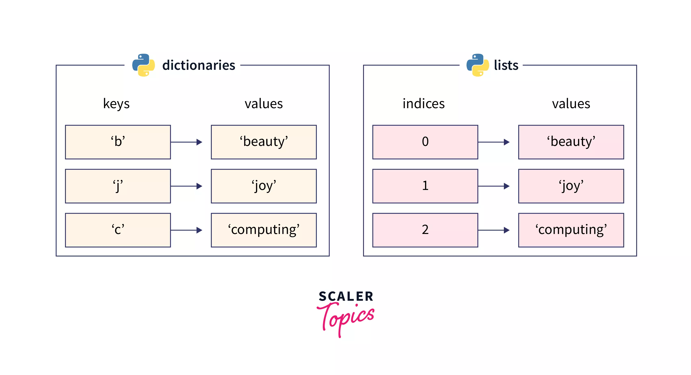

# Dizionari

I dizionari sono una delle strutture dati piu importanti. 

Da un punto di vista operativo possiamo considerare i dizionari in modo simile alle liste. La differenza principale risulta che la chiave puo essere qualsiasi oggetto immutabile. 

# Esempio di utilizzo 
Utilizziamo un dizionario per associare ad ogni persona il suo colore preferito.
```python 
#Creazione del dizionario
dizionario = {"Mattia":"Verde", 
              "Francesco":"Rosso", 
              "Vincenzo":"Blu",
              "Lorenzo":"Blu"}

```
Modificare un valore, Mattia cambia idea e decide che il suo colore preferito non e piu il verde ma il Giallo. 
```python 
#Modifica del valore associato alla chiave
dizionario["Mattia"] = 'Giallo'
```
Aggiungere una coppia chiave valore. Si aggiunge una nuova persona, Andrea, il cui colore preferito e il viola. 
```python 
#Aggiungere un elemento
dizionario["Andrea"] = "Viola"
```
**ATTENZIONE**: Aggiungere un elemento e modificare il valore hanno la stessa sintassi. Se si pensa di aggiungere un elemento che in realta e gia stato inserito si andra a modificare il valore associato. 

I dizionari mettono a disposizione svariati metodi, far riferimento alle slide o per una trattazione piu dettagliata: https://www.w3schools.com/python/python_ref_dictionary.asp
# Esercizi Svolti 
Ecco un elenco degli esercizi svolti utili a capire meglio come utilizzare i dizionari. 
- [Raccogliere informazioni di un utente](./Informazioni_utente/)